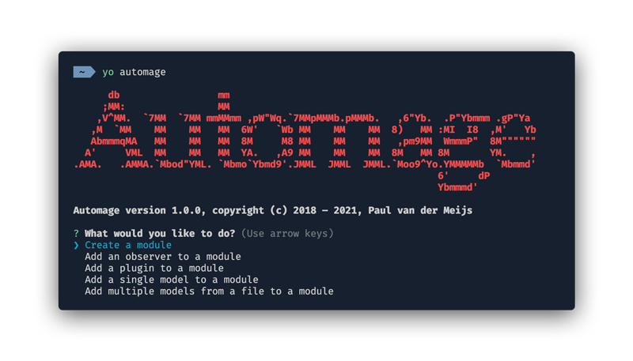

# PHAB

Yeoman generator for Magento 2.



## Installation

First make sure you have installed Yeoman. If not, install Yeoman using:

```bash
npm install -g yo
```

Next install the generator using:

```bash
npm install -g generator-automage
```

## Usage

To see a list of all the available generators use the following:

```bash
yo automage
```

Specific generators can also be called directly. E.g.:

```bash
yo automage:module
```

## Generators

Available generators are listed below.

* ### automage:module

  Creates a new module in `app/code`. The generator will try to resolve the root of your Magento installation or otherwise create the module relative to the working directory.

* ### automage:module:observer

  Creates a new observer and adds it to `events.xml`. This generator will try to resolve the module root or otherwise ask for a vendor and module name.

* ### automage:module:plugin

  Creates a new plugin and adds it to `di.xml`. This generator will try to resolve the module root or otherwise ask for a vendor and module name.

* ### automage:module:model [<model_name>]

  Create a single model and its interface with accessors for its properties. This generator will try to resolve the module root or otherwise ask for a vendor and module name.

  Properties can be provided from either a YAML or JSON file containing an array of either property names or objects having a name and type property. E.g.:

  ```yaml
  - name
  - name: age
    type: int
  ```

* ### automage:module:models [<models_file>]

  Create multiple models and their interfaces from the model names and properties provided in given file. This generator will try to resolve the module root or otherwise ask for a vendor and module name.

  The models file should be in either YAML format containing a document for each model or JSON format containing an array. Each model should have at least a name and optionally an array of properties. E.g:

  ```yaml
  --- # Dog
  name: animals/dog
  properties:
    - name
    - name: age
      type: int
  --- # Car
  name: vehicles/car
  properties:
    - name: number_of_wheels
      type: int
    - name: speed
      type: float
    - name: locked
      type: bool
  ```
